# 機械学習のための関数解析の基礎の基礎

2021--

---

## はじめに

- 本スライドでは機械学習への応用を見据えて，関数解析の基礎を概観する
  - とくに，ヒルベルト空間と有界線形汎関数について
- 集合・位相，線形代数，解析学に関する基本的な内容は既知であると仮定する

---

## なぜ関数解析？

- 「機械学習」という分野は様々な手法のごった煮
- **見通しよく理解したい**
  - 各手法を個別に理解するよりも土台をしっかりと理解して，その特別な場合として個々の手法を理解するほうが効率的

「自分たちの目の前にある問題を解決するためには，まず原理・原則を身に着け，統一的な視点から各手法を眺めることが必要になる」（[山田先生のPDF][yamada_pdf]より引用）

---

## 関数解析とは？

- 一言で言うと「無限次元の線形代数」
  - 関数の集合を対象にして線形代数を展開する

物理学：
- 自然現象における着目する系の状態を1変数 or 多変数の関数でモデル化し，与えられた条件下でどのような状態が実現するか調べたい

機械学習：
- 手元にあるデータの規則や構造を抽出して，未知のデータに対して「予測」したい

「可能な関数の集合の中から条件を満たす特定の関数を探す」ことに帰着

---

## 応用に機械学習を見据えて関数解析に取り組むために

[Cybenko, George. "Approximation by superpositions of a sigmoidal function." Mathematics of control, signals and systems 2.4 (1989): 303-314.][cybenko]

**ニューラルネットワークの普遍性定理**をサブゴールに設定
- 選択理由
  - ‎被引用数：13382 (2020-11-04 Google Scholar調べ)
  - 証明の核心的な部分で，関数解析の主要な定理2つが用いられている

---

## ニューラルネットワークの普遍性定理

**[Thm]**
$X$を局所コンパクトハウスドルフ空間とする．$\sigma:\mathbb{R} \rightarrow \mathbb{R}$を連続な sigmoidal 関数とすると，
$$
  G(x) = \sum^N_{j=1} \alpha_j \sigma(\langle x,y_j \rangle + \theta_j) \quad (N \in \mathbb{N},\  \alpha_j, \theta_j \in \mathbb{R},\ x, y_j \in \mathbb{R}^d)
$$
という形をした$X$上の関数全体の集合$\mathcal{G}$は，$\mathbb{R}^d$上の実数値連続関数全体の集合$C(X)$で稠密になる．
すなわち，任意の$f \in C(X)$と任意の正数$\epsilon$に対して，上の形で表現される関数$G$を適当にとれば，
$$ \forall x \in X, \quad |f(x)-G(x)|< \epsilon $$
が成立する．

---

## ニューラルネットワークの普遍性定理の証明の概要

1. リース・マルコフ・角谷の表現定理
2. ハーン・バナッハの拡張定理
3. sigmoidal関数はdiscriminatory関数

1.と2.が関数解析の主要な定理
3.は普遍性定理証明のための補題

本スライドでは1.の内容を紹介

---

# しようと思いましたが

---

## リース・マルコフ・角谷の表現定理に必要な数学の範囲
- 位相空間論
  - 局所コンパクトハウスドルフ空間
  - パラコンパクト空間
    - 1の分解
- 測度論
  - 一般の集合上の測度
    - ボレル測度
    - ラドン測度
- ルベーグ積分
  - 一般の集合上のルベーグ積分

上記の知識を前提とする．（説明しきれない．）

---
# リースの表現定理を証明することを目指す
- 事前知識は学部レベルの集合・位相，線形代数，解析学の知識のみ

---

## 記号の約束

- [Def]は定義，[Thm]は定理，[Prf]は証明，[N.B.]は注意を表す．
- 絶対値を$|\cdot|$で表す．
- $\mathbb{N}$は自然数全体の集合，$\mathbb{Q}$は有理数全体の集合，$\mathbb{R}$は実数全体の集合，$\mathbb{C}$は複素数全体の集合を表す．

---

## 線形空間

**[Def]**
集合$\mathbf{V}$の任意の 2 元$f,g$と，任意の$a \in \mathbb{R}(または\mathbb{C})$に対し，和$f \oplus g\in \mathbf{V}$と積$a*f \in \mathbf{V}$が定義され，次の条件を満たしているとき，$\mathbf{V}$を線形空間という．

1. $(f \oplus g) \oplus h = f \oplus (g \oplus h)$（和の結合律）
2. 任意の$f \in \mathbf{V}$に対して$f \oplus 0=f$となる元$0 \in \mathbf{V}$が存在（零元の存在）
3. 各元$f \in \mathbf{V}$に対して，$f \oplus f'=0$となる元$f' \in \mathbf{V}$が存在（逆元の存在）
4. $(ab)*f = a*(b*f)$（積の結合律）
5. $1*f = f$
6. $a*(f \oplus g)=(a*f) \oplus (b*g)$（分配律）
7. $(a+b)*f=(a*f) \oplus (b*g)$（分配律）

混乱の恐れがないとき，$f \oplus g$を$f+g$で表し，$a*f$を$af$で表す．
本スライドでは基本的に実線形空間について述べる．

---

## 線形空間の例
$\mathbf{V}=\mathbb{R}^2$：実2次元数ベクトル
$\mathbb{R}^2$の元$f=\dbinom{a_1}{a_2},g=\dbinom{b_1}{b_2}$と実数$a$に対して，通常の和と積で定義すれば，
$\mathbb{R^2}$は実線形空間
$$f+g = \dbinom{a_1+b_1}{a_2+a_2}, \; af=\dbinom{a*a_1}{a*a_2}$$

$\mathbf{V}=C[a,b]$：有界閉区間$[a,b]$上で定義された実数値連続関数の全体
２つの関数の和および実数との積を通常のように定義すれば，$C[a,b]$は実線形空間

---

## ノルムとノルム空間

**[Def]**
実線形空間$\mathbf{V}$の任意の元$f$に対して一つの実数を対応させる関数$\|f\|$が次の条件を満たすとき，関数$\|\cdot\|$を**ノルム**という．

1. $\| f \| \ge 0$．かつ，等号が成立するのは$f=0$の場合であり，その場合に限る．
2. 任意の実数$a$に対して，次の関係が成立する．
$$
\|af\| = |a|\|f\|
$$
3. $\mathbf{V}$の任意の元$f, g$に対して，次の三角不等式成立する．
$$
\|f+g\| \le \|f\|+\|g\|
$$

ノルムの定義された線形空間をノルム空間という．

---

## ノルムの例
実2次元数ベクトル空間の元$f = \dbinom{a_1}{a_2}$に対して，ユークリッドノルムは
$$\|f\| = \sqrt{|a_1|^2+|a_2|^2}$$
$C[a,b](\not ={\emptyset})$：有界閉区間$[a,b]$上で定義された実数値連続関数の全体
に対して，
$$\|f\| = \max_{a \le x \le b} |f(x)|$$
とおけばノルムになる．Cノルムとよぶ．
$C[a,b]$上の元$f$に対して，
$$\|f\|_2 = \bigg(\int_a^b |f(x)|^2dx \bigg)^{\frac{1}{2}}$$
とおけばノルムになる．$L^2$ノルムとよぶ．

---

## バナッハ空間

**[Def]**
完備なノルム空間をバナッハ空間$\mathcal{B}$という．

### バナッハ空間の例
$C[a,b]$はCノルムに関してバナッハ空間
$C[a,b]$は$L^2$ノルムに関してバナッハ空間ではない
ルベーグ2乗可積分な関数の集合：$L^2$空間は$L^2$ノルムに関してバナッハ空間

---

## 内積

**[Def]**
実線形空間$\mathbf{V}$の任意の2元$f, g$に対し一つの実数を対応させる関数$\langle f, g \rangle$が次の条件を満たすとき，関数$\langle \cdot, \cdot \rangle$を内積という． ここで，$f,g,h \in \mathbf{V}$，$a,b \in \mathbb{R}$とする．
1. $\langle g, f \rangle = \langle f, g \rangle$
2. $\langle af+bg, h \rangle = a\langle f, h \rangle + b\langle g, h \rangle$
3. $\langle f, f \rangle \geq 0$，かつ等号が成立するのは$f=0$の場合に限る．

---

## 内積空間

**[Def]**
内積が定義された線形空間を内積空間という．

内積空間にはノルムを定義することができる．内積空間の任意の元$f$に対して，
$$
\|f\| = \sqrt{\langle f, f \rangle}
$$
と定義するとき，これを内積から自然に導かれるノルムという．
内積空間はこの$\|f\|$に関してノルム空間になり，このノルムに関して距離空間になる．

---

## ヒルベルト空間

**[Def]**
完備な内積空間をヒルベルト空間$\mathcal{H}$という．

[N.B]
このスライドでは，ヒルベルト空間のうち可分なもののみを対象として考える．
可分でないヒルベルト空間は，量子力学で扱う対象に必要な場合があるそうです．
詳しくは知りません．

---

## ヒルベルト空間の位置づけ
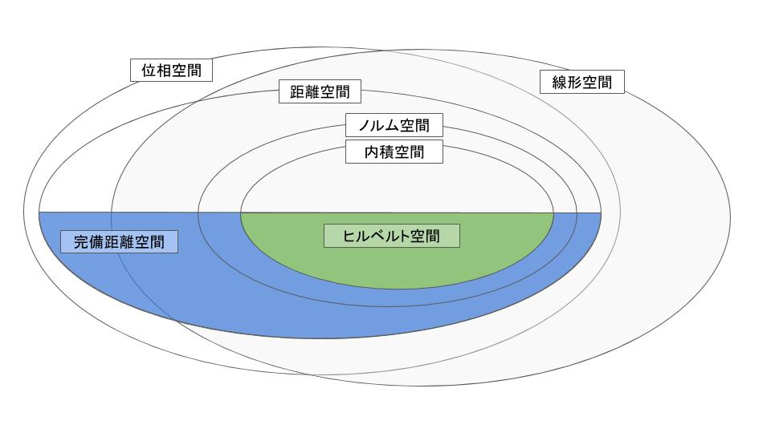

---

## 直交と直交補空間

**[Def]**
$\mathcal{H}$の各元にたいする直交性：
$\mathcal{H}$の元$f,g$に対して$\langle f, g \rangle=0$が成立するとき，$f$と$g$は直交しているという．

$\mathcal{H}$の部分集合に対する直交性：
$\mathbf{S},\mathbf{G}$を$\mathcal{H}$の部分集合とする．$f\in \mathcal{H}$が$\mathbf{S}$に属するすべての元と直交しているとき，$f$は$\mathbf{S}$と直交するという．$\mathbf{S}$の任意の元が$\mathbf{G}$と直交するとき，「$\mathbf{S}$と$\mathbf{G}$は直交する」という．

**[Def]**
$\mathbf{S}$に直交する元の全体の集合を$\mathbf{S}^\perp$で表し，$\mathbf{S}$の直交補空間という．
$\mathbf{S}^\perp$は$\mathcal{H}$の閉部分空間になる．

---

## 直交展開

$\mathcal{H}$の元の組$\{ u_n \}^\infty_{n=1}$に対して， $\langle u_m,u_n \rangle=0 \ (m \not ={n})$が成立するとき，$\{ u_n \}^\infty_{n=1}$を$\mathcal{H}$の直行系という．任意の$n$に対して$\| u_n\|=1$になるとき，正規直交系という．
$\mathcal{H}$の正規直交系の線形和を次のように表す．
$$f  = \sum^\infty_{n=1} a_n u_n \qquad \qquad (1)$$
線形和$f$が収束しているとき，各$a_n$と$f$のノルムは次のようになる．
$$\ a_n = \langle f,u_n \rangle \ (n=1,2,\cdots), \qquad \| f\| ^2= \sum^\infty_{n=1}|a_n|^2$$
$\{ a_n \}^\infty_{n=1}$を正規直交系$\{ u_n \}^\infty_{n=1}$に関する$f$の展開係数といい，式 (1) を$f$の直行展開という．

---

## 直行展開の例
フーリエ級数展開

区間$[-\pi,\pi]$上の実数値連続関数の全体を$C[-\pi,\pi]$とし，$f,g\in C[-\pi,\pi]$とする．
内積を
$$
\langle f,g \rangle = \int^\pi_{-\pi}f(x) {g(x)}dx
$$
で定義し，関数系$\{u_n\}^\infty_{n=0}$を
$$
u_0= \frac{1}{\sqrt{ 2\pi }},\quad
u_{2n-1}=\frac{1}{\sqrt{\pi}}\cos nx,\quad
 u_{2n}=\frac{1}{\sqrt{\pi}}\sin nx
$$
で定義する．
関数系$\{u_n\}^\infty_{n=0}$は正規直交系になる．

---
## 直行展開の例
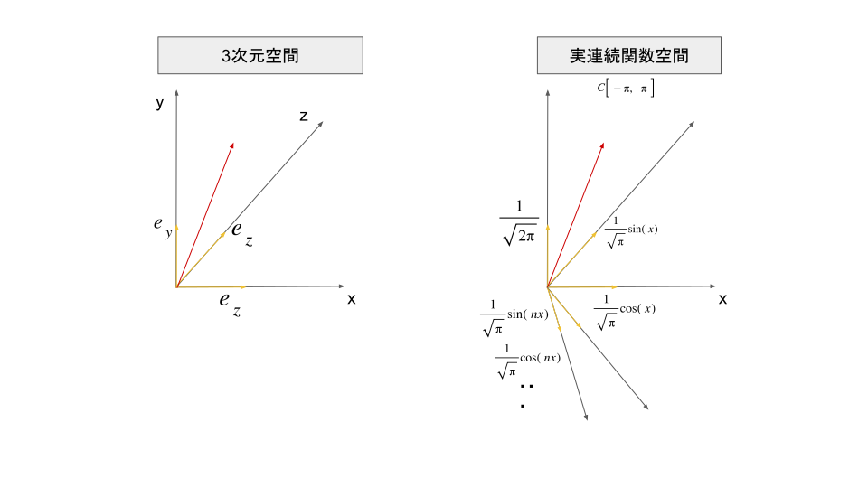

---
## 直行展開の例
ルジャンドル多項式
区間$[-1,1]$のルベーグ2乗可積分関数の全体$L^2[-1,1]$の$n$次多項式$P_n(x)$を考える．

ロドリゲスの公式
$$
P_n(x)=\frac{1}{2^n n!}f^{(n)}_n(x)
$$
ただし，$f_n(x)=(x^2-1)^n$
を満たす多項式をルジャンドル多項式という．

具体的に計算すると，
$$
P_0(x)=1,\quad
P_1(x)=x,\quad
P_2(x)=\frac{3}{2}x^2-\frac{1}{2},\quad
P_3(x)=\frac{5}{2}x^3-\frac{3}{2}x,\dots
$$

---
## 直行展開の例
ルジャンドル多項式$P_n(x)$は$n-1$次以下の多項式と直交する．
$P_3(x)=\frac{5}{2}x^3-\frac{3}{2}x$を取り上げる．

$\langle x,P_3(x) \rangle = \int_{-1}^{1}(x) (\frac{5}{2}x^3-\frac{3}{2}x)dx=0$
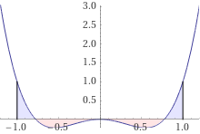

$\langle P_2(x),P_3(x) \rangle = \int_{-1}^{1}(\frac{3}{2}x^2-\frac{1}{2}) (\frac{5}{2}x^3-\frac{3}{2}x)dx=0$
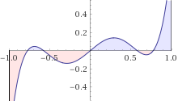

---
## 有界線形汎関数

**[Def]**
ノルム空間$\mathbf{X}(\not ={\{0\}})$（ノルム$\|\cdot\|_X$）から$\mathbf{Y}$（ノルム$\|\cdot\|_Y$）への線形写像について， 線形写像$A:\mathbf{X} \rightarrow \mathbf{Y}$に対してある$K \geq 0$が存在し，
$$\| A(x) \|_\mathbf{Y} \leq K\|x\|_\mathbf{X} \qquad (\forall x \in \mathbf{X})$$
が成立するとき，$A$を有界であるといい，有界な線形写像を有界線形写像という．

ノルム空間$\mathbf{Y}$が$\mathbb{R}$（ノルムは絶対値ノルム$|\cdot|$）であるとき，
有界線形写像$A:\mathbf{X} \rightarrow \mathbb{R}$は有界線形汎関数と呼ばれる．

---

## 内積空間における有界線形汎関数の表現

$\mathbf{X}$を内積空間とする．$\mathbf{X}$上の任意の有界線形汎関数$f:\mathbf{X} \rightarrow \mathbb{R}$に対して，$\mathbf{X}$のコーシー列$(z_n)^\infty_{n=1}$が存在し，
$$f(y) = \lim_{n \rightarrow \infty} \langle y,z_n \rangle \qquad (\forall y \in \mathbf{X})$$
$$\| f \| = \lim_{n \rightarrow \infty} \|z_n\|_\mathbf{X}$$
と表現できる． ここで，$\| \cdot \|$は有界線形汎関数のノルム，$\| \cdot \|_\mathbf{X}$は$\mathbf{X}$上に定義された内積から自然に導かれるノルムである．

---

## リースの表現定理

**[Thm]**
$\mathcal{H}$において内積から誘導されるノルムを$\|x\|_\mathcal{H}$と表すとき，$\mathcal{H}$上の任意の有界線形汎関数$f$に対して，ある$v_f \in \mathcal{H}$が存在し，$f$は
$$f(x) = \langle x,v_f \rangle \quad (x \in \mathcal{H})$$
のように表現できる．
$v_f$は$f$から一意に定まり，$f$のノルムは$\|f\| = \|v_f\|_\mathcal{H}$となる．

---
## リースの表現定理の証明
**[Prf]**
$f$を$\mathcal{H}$上の有界線形汎関数とする．$\mathcal{H}$の閉部分空間$\mathbf{M}$を$\mathbf{M}=\{x \in \mathcal{H};f(x)=0\}$，$\mathbf{M}$の直交補空間を$\mathbf{M}^\perp$とおく．$h \in \mathbf{M}^\perp$をとる．ここで，$f$の線形性より
$$
0=f(x)-f(x)=f(x)-\frac{f(x)}{f(h)}f(h)=f \Big(x-\frac{f(x)}{f(h)}h \Big)
$$
よって，$x-\frac{f(x)}{f(h)}h \in \mathbf{M}$．$h \in \mathbf{M}^\perp$と内積の性質より，
$$
\langle x-\frac{f(x)}{f(h)}h, h \rangle = \langle x, h \rangle - \frac{f(x)}{f(h)}\langle h, h \rangle =\langle x,h\rangle - \frac{f(x)}{f(h)}\|h\|^2_\mathcal{H}= 0
$$
$v_f = \frac{f(h)}{\|h\|^2_\mathcal{H}}h$とおくと，
$$f(x) =\frac{f(h)}{\|h\|^2_\mathcal{H}}\langle x,h \rangle= \langle x, v_f \rangle \qquad \qquad\qquad\qquad\qquad\qquad\Box$$

---

## ニューラルネットワークの普遍性定理の直感的な説明

ニューラルネットワークの普遍性定理を題材にしておいて，中身について触れないのも詐欺なので[鈴木先生のスライド][taiji2]のp.25より概説を引用

---
## ニューラルネットワークの普遍性定理の直感的な説明

[鈴木先生のスライド][taiji2]のp.25より概説を引用
sigmoidal な関数のスケールを適切に選べば，ステップ関数をいくらでも精度良く近似することができる．
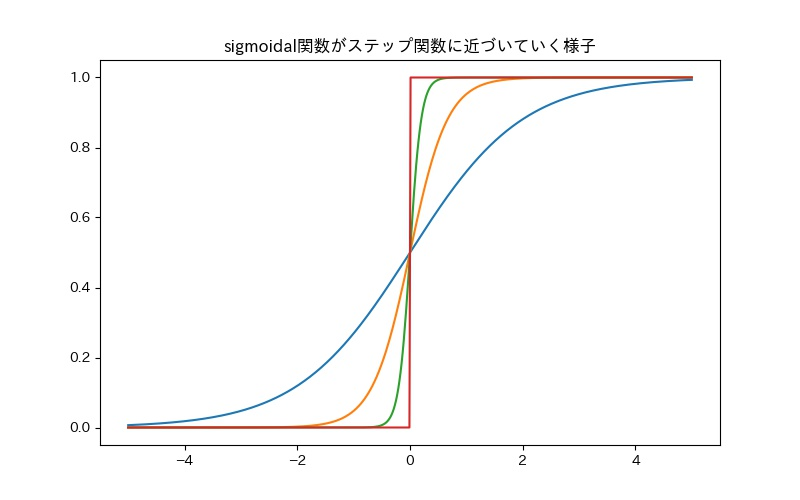

---
## ニューラルネットワークの普遍性定理の直感的な説明

[鈴木先生のスライド][taiji2]のp.25より概説を引用
階段関数を近似することができれば，それらを足し合わせることで，三角関数をいくらでも精度良く近似することができる．
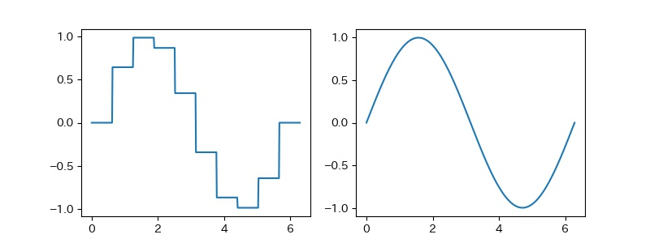

---
## ニューラルネットワークの普遍性定理の直感的な説明

[鈴木先生のスライド][taiji2]のp.25より概説を引用
階段関数を近似することができれば，それらを足し合わせることで，三角関数をいくらでも精度良く近似することができる．
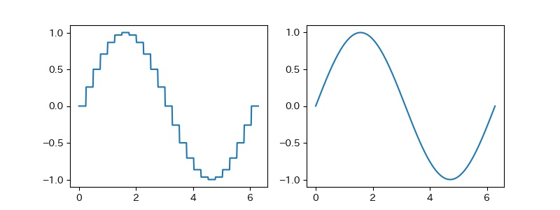

---
## ニューラルネットワークの普遍性定理の直感的な説明

[鈴木先生のスライド][taiji2]のp.25より概説を引用
階段関数を近似することができれば，それらを足し合わせることで，三角関数をいくらでも精度良く近似することができる．
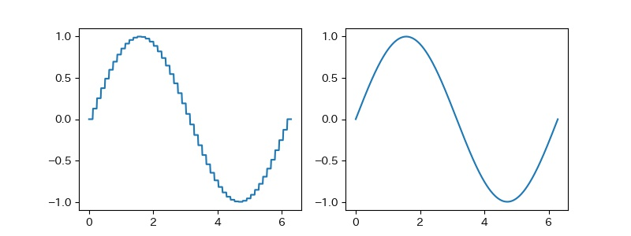

---
## ニューラルネットワークの普遍性定理の直感的な説明

[鈴木先生のスライド][taiji2]のp.25より概説を引用
階段関数を近似することができれば，それらを足し合わせることで，三角関数をいくらでも精度良く近似することができる．
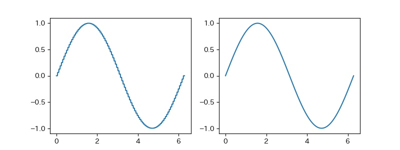

---
## ニューラルネットワークの普遍性定理の直感的な説明

[鈴木先生のスライド][taiji2]のp.25より概説を引用
階段関数を近似することができれば，それらを足し合わせることで，三角関数をいくらでも精度良く近似することができる．
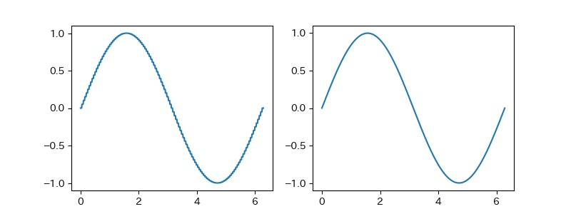

---
## ニューラルネットワークの普遍性定理の直感的な説明

[鈴木先生のスライド][taiji2]のp.25より概説を引用
階段関数を近似することができれば，それらを足し合わせることで，三角関数をいくらでも精度良く近似することができる．
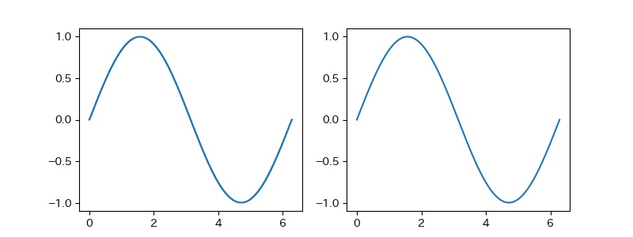

---

## ニューラルネットワークの普遍性定理の直感的な説明

[鈴木先生のスライド][taiji2]のp.25より概説を引用
三角関数を近似することができれば，それらを足し合わせることで，任意の連続関数をいくらでも精度良く近似することができる．

すなわち，
「3 層ニューラルネットワークの中間層のノードを十分な数用意すれば，任意の連続関数をいくらでも精度良く近似することができる．」
ということが主張できる．

---
## ニューラルネットワークの普遍性定理を理解する上で必要な知識

本スライドは関数解析の線形代数の側面を重点的に説明
行間を埋めるためには，位相空間とルベーグ積分に関する知識が必要

- 集合・位相
  - 距離空間・完備距離空間
  - 位相空間
  - コンパクト空間・局所コンパクト空間
  - ハウスドルフ空間

---
## ニューラルネットワークの普遍性定理を理解する上で必要な知識
- 測度論
  - $\mathbb{R}^d$上のルベーグ測度と外側度
  - 一般の集合上の測度（ボレル測度）
- ルベーグ積分
  - 可測関数
  - $\mathbb{R}^d$上で定義される可測関数に対するルベーグ積分
  - 一般集合上で定義される可測関数に対するルベーグ積分積分
  - $L^p$空間・$L^2$空間

---
## 参考資料

- [「集合と位相」をなぜ学ぶのか ― 数学の基礎として根づくまでの歴史　(藤田博司)][fujita]
- [固有値問題 30 講　(志賀浩二)][shiga1]
- [ルベーグ積分 30 講　(志賀浩二)][shiga2]
- [測度・確率・ルベーグ積分　応用への最短コース　(原啓介)][hara]
- [工学のための関数解析　(山田功)][yamada]
- [工学系の関数解析　(小川英光)][ogawa]
- [深層学習の数理　大阪大学集中講義　(鈴木大慈)][taiji1]
- [深層学習の数理：カーネル法，スパース推定との接点　(鈴木大慈)][taiji2]

[cybenko]: https://link.springer.com/article/10.1007/BF02551274
[fujita]: https://gihyo.jp/book/2018/978-4-7741-9612-1
[shiga1]: https://www.asakura.co.jp/books/isbn/978-4-254-11485-0/
[shiga2]: https://www.asakura.co.jp/books/isbn/978-4-254-11484-3/
[hara]: https://bookclub.kodansha.co.jp/product?item=0000149472
[yamada]: https://www.saiensu.co.jp/search/?isbn=978-4-901683-62-3&y=2009
[ogawa]: https://www.morikita.co.jp/books/book/445
[taiji1]: https://www.slideshare.net/trinmu/ss-161240890
[taiji2]: https://www.slideshare.net/trinmu/ss-237399755
[yamada_pdf]:http://www.sp.ict.e.titech.ac.jp/index.php?plugin=attach&refer=%BB%B3%C5%C4%B8%A6%B5%E6%BC%BC&openfile=Functional-Analysis-IsaoYamada2017-April24b.pdf
---

## まとめ
- 機械学習は様々な手法の「ごった煮」
  - それぞれの手法を個別に理解するのではなく，まずは理解のための土台を作るほうが良い
- ニューラルネットワークの普遍性定理を題材に，関数解析の初歩的な部分を紹介
  - ヒルベルト空間
  - 有界線形汎関数
  - リース表現定理

---

## Appendix
**[Def]** 収束，ノルム収束
ノルム空間$\mathbf{X}$の点列$\{ x_n \} (n=1,2, \dots)$が$\|x_n -x\| \rightarrow 0 \  (n \rightarrow \infty)$を満たすとき，$\lim_{n \rightarrow \infty}x_n=x$ と表し，点列$\{x_n\}^\infty_{n=1}$は$x$に収束するという．

**[Def]** コーシー列
点列$\{ x_n \} (n=1,2, \dots)$が
$$
\| x_m - x_n \| \rightarrow 0 \quad (m,n \rightarrow \infty)
$$
を満たすときコーシー列という．

**[Def]** 完備
$\mathbf{X}$の任意のコーシー列が$\mathbf{X}$の点に収束するとき，$\mathbf{X}$を**完備**な空間という．

---

## Appendix
**[Def]** 可分
ヒルベルト空間$\mathcal{H}$に，高々可算かつ稠密な部分集合が存在するとき，$\mathcal{H}$は可分であるという．

**[Def]** 稠密
ノルム空間$\mathbf{X}$の 2 つの部分集合$S_1，S_2$に対して，それらの閉包$\overline{S_1}，\overline{S_2}$が$\overline{S_1} \supseteq \overline{S_2}$の関係を満たすとき，$S_1$は$S_2$で稠密という．
$\overline{S}=\mathbf{X}$が成立するとき，$S$は$\mathbf{X}$で稠密であるという．

---

## ハーン・バナッハの拡張定理

**[Thm]**
$\mathbf{X}$を内積空間とし，$\mathbf{M}$を$\mathbf{X}$の部分空間とする．$g:\mathbf{M} \rightarrow \mathbb{R}$が$\mathbf{M}$上の有界線形汎関数であるとき，$\mathbf{X}$上の有界線形汎関数$f:\mathbf{M} \rightarrow \mathbb{R}$で次の条件を満たすものが存在する．

1. $$f(x)=g(x) \qquad (\forall x \in \mathbf{M})$$
1. $$\|f\| \coloneqq \sup_{x\in \mathbf{X} \setminus \{0\}} \frac{|f(x)|}{\|x\|_\mathbf{X}}=\|g\| \coloneqq \sup_{x \in \mathbf{M} \setminus \{0\}} \frac{|g(x)|}{\|x\|_\mathbf{X}} < \infty$$

(1.) の条件が成り立つとき，「$f$は$g$の拡張」または「$g$は$f$の$\mathbf{M}$への制限」という．
ここで，$\| \cdot \|$は有界線形汎関数のノルム，$\| \cdot \|_\mathbf{X}$は$\mathbf{X}$上に定義された内積から自然に導かれるノルムである．

---

## ハーン・バナッハの拡張定理の証明

**[Prf]**
$g$に対して，$\mathbf{M}$のコーシー列$\{ z_n\}^\infty_{n=1}$が存在し，
$$g(x) = \lim_{n \rightarrow \infty} \langle x, z_n \rangle \quad (\forall x \in \mathbf{M})$$
$$\|g\| = \lim_{n \rightarrow \infty} \|z_n\|_\mathbf{M} \quad (\|z\|_\mathbf{M} = \|z\|_\mathbf{X}, \forall z \in \mathbf{M})$$
と表せる．$\{ z_n\}^\infty_{n=1}$は$\mathbf{X}$のコーシー列でもあるから
$$f(x) \coloneqq \lim_{n \rightarrow \infty} \langle x,z_n \rangle \qquad (\forall x \in \mathbf{X})$$
によって有界線形汎関数$f$を定義することができ，明らかに (1.)を満たす．
また，以下により (2.)も満たすことがわかる．
$$\|f \| = \lim_{n \rightarrow \infty}\|z_n\|_\mathbf{X} = \lim_{n \rightarrow \infty}\|z_n\|_\mathbf{M} = \|g\|$$

---

## リース・マルコフ・角谷の表現定理
TODO:一応書く

---

## sigmoidal関数はdiscriminatory関数
TODO:一応書く

---

## 書評（個人の感想です）

- [「集合と位相」をなぜ学ぶのか ― 数学の基礎として根づくまでの歴史　(藤田博司)][fujita]
  - 数学史の本．一般の人向け．学部 1 年のときになぜ集合と位相から学び始めるのかがわかる．モチベーションがあがるし，全然難しくないのでめちゃくちゃオススメ．1800 年～の数学において，それぞれの時代における何の問題を解決したいがためにある概念が考案されたのかのストーリーが楽しい．
- [固有値問題 30 講　(志賀浩二)][shiga1]
  - 行列の数学としての線形代数から抽象的な線形代数の橋渡しになる．ヒルベルト空間の理論体系がなぜ組み上がったのかの話がのっており，オススメ．

---

## 書評（個人の感想です）

- [ルベーグ積分 30 講　(志賀浩二)][shiga2]

  - 理学系以外の人がルベーグ積分を始めるときにはここから読み始めるのがベストだとおもう．とてもとてもオススメ．読者に寄り添っている．京大博士にルベーグ積分学びたいんだけど一番最初に読むならどれ？と聞いたらこの本とコルモゴロフの本をあげてくれた．コルモゴロフは敷居が高い…

- [測度・確率・ルベーグ積分　応用への最短コース　(原啓介)][hara]
  - 一度ルベーグ積分を概観した人が，見直しとして読むには良いと思うおそらく．短くまとまっている．測度やルベーグ積分という単語をはじめて知った人が読むと，法則や話が天から降ってくるような感じがする．

---

## 書評（個人の感想です）

- [工学のための関数解析　(山田功)][yamada]
  - 工学系の人間が，応用も視野にいれつつ，関数解析の話についていけるように配慮されている．著者が信号処理，データサイエンス系の人なので，話題に親近感がわく．見た目がきれい．例がたくさんでわかりやすいと人気だが，最初にとりくんだときには定義も定理も例もはいってこなかった．
- [工学系の関数解析　(小川英光)][ogawa]
  - 上と名前が似ている．証明の行間がほとんど無く，とてもオススメ．この本の内容を参考に本スライドを作成した．数学者が書いた数学書を読めない雑魚に優しい．

