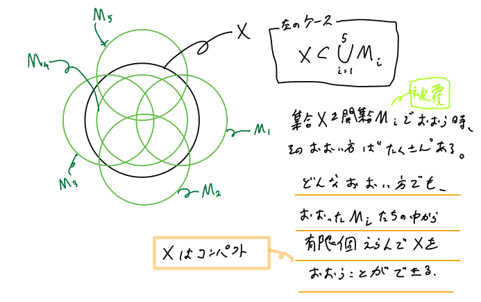

# 集合と位相のメモ

---
# はじめに
機械学習のための関数解析の基礎の基礎に用いる、集合・位相の種々の言葉を定義する。

リース・マルコフ・角谷の表現定理の舞台として局所コンパクトハウスドルフ空間がでてくる。
これを定義することを目指す。

---
# 記号
- $\mathbb{N}$は自然数全体の集合、$\mathbb{Q}$は有理数全体の集合、$\mathbb{R}$は実数全体の集合、$\mathbb{C}$は複素数全体の集合を表す。
- $\varnothing$ を空集合とする。

---
# 本スライドの目指すところ
**[Def]** 局所コンパクトハウスドルフ空間
$X$ が局所コンパクトかつハウスドルフであるとき、$X$を局所コンパクトハウスドルフ空間という。

**[Thm]**
局所コンパクトハウスドルフ空間は正則である。

---
# 位相
**[Def]**
集合$X(\not = \varnothing)$の部分集合系を $\mathcal{D}$ とする。$\mathcal{D}$ が次の3つの条件をみたすとき、
$\mathcal{D}$ を $X$ の**位相**という。
1. $\varnothing, X \in \mathcal{D}$
2. $O_1, O_2 \in \mathcal{D} \Rightarrow O_1\cap O_2 \in \mathcal{D}$
3. $(O_\lambda)_{\lambda \in \Delta}$ を $\mathcal{D}$ の元からなる集合族とすると、$\bigcup_{\lambda\in\Delta}O_\lambda \in \mathcal{D}$

$\mathcal{D}$ の元を**開集合**という。$X$ を位相空間とし、$A\subset X$ とする。
$X\setminus A$ が $X$ の開集合のとき、$A$ を $X$ の**閉集合**という。
$B \subset X$ を含む最小の閉集合を $\overline{B}$ と表し、$B$ の**閉包**という。

---
# 近傍
**[Def]** 近傍と基本近傍系
$X$ を位相空間とし、$x\in X,\ U \subset X$ とする。
$X$ のある開集合 $O$ が存在し、$x\in O \subset U$ となるとき、$x$ を $U$ の内点という。内点全体の集合を内部という。
$x$ が $U$ の内点のとき、$U$ を $x$ の**近傍**という。$X$ の開集合となる近傍を開近傍、$X$ の閉集合となる近傍を閉近傍という。

$x$ の近傍全体の集合を $\mathfrak{U}(x)$ と表し、$x$ の近傍系という。
$\mathfrak{U}^*(x) \subset \mathfrak{U}(x)$ とする。任意の $U \in \mathfrak{U}(x)$ に対して、ある $U^* \in \mathfrak{U}^*(x)$ が存在し、$U^* \subset U$ となるとき、$\mathfrak{U}^*(x)$ を $x$ の**基本近傍系**という。

---
# 被覆
**[Def]**
$X$ を位相空間とする。
$X$ の部分集合の族
$$ M = \{M_\lambda \}_{\lambda\in \Delta}\quad (M_\lambda \subset X) $$
はその和集合が $X$ 全体となるとき、すなわち $X = \bigcup_\lambda M_\lambda$ となるとき $X$ の**被覆**という。すべての $M_\lambda$ が開（閉）集合のとき $M$ を開（閉）被覆という。添字の集合 $\Delta$ が有限の場合、$M$ を有限被覆という。

$X$ の２つの被覆を $M = \{M_\lambda\},\ N =\{N_\mu\}$ とする。
$N \subset M$ のとき、$N$ は $M$ の部分被覆という。

---
# コンパクト
**[Def]**
位相空間 $X$ はその**任意**の開被覆が有限部分被覆をもつとき、**コンパクト**という。

つまり、$X$ がコンパクトとは、その任意の開被覆 $M = \{M_\lambda\}$ に対して、
有限個の $\lambda_1, \cdots, \lambda_k \in \Delta$ を選んで、
$$ X = \bigcup^k_{i=1}M_{\lambda_i} $$
とできる場合のことをいう。

[N.B.]
$X$ のいろんな覆い方が存在するが、その覆い方の中から有限個選ぶだけで、$X$ が覆うことができる。
すべての覆い方の中で、その有限個の覆い方が存在するという強い主張。

---
# コンパクトのイメージ

---
# ハイネ・ボレルの定理
**[Thm]**
$\mathbb{R}$ の任意の区間がコンパクトであるための必要十分条件は有界かつ閉であること。

**[Prf]** (有界閉区間 $\Rightarrow$ コンパクトを示す)
単位閉区間 $I=[0,1]$ について示せば十分。$\mathbb{M}=\{M_\lambda\}$ を $I$ の任意の開被覆とするとき、$I$ は有限個の $M_\lambda$ で被覆されることを示す。
被覆の定義より、ある $\lambda_1$ に対して $0\in M_{\lambda_1}$ となる。
ここで、もし $I\subset M_{\lambda_1}$ ならば $I$ は1個の $M_{\lambda_1}$ で覆えたことになる。
そうでないとする。$M_{\lambda_1}$ は開集合だから、ある $0< a_1 <1$ が存在して $[0,a_1)$ は1個の $M_\lambda$ で覆えていることになる。つぎに $a_1\in M_{\lambda_2}$ となるような $\lambda_2$ が存在する。
もし $I\subset M_{\lambda_1}\cup M_{\lambda_2}$ ならば $I$ は2個の $M_\lambda$ で覆えたことになる。

---
# ハイネ・ボレルの定理
**[Prf]** (有界閉区間 $\Rightarrow$ コンパクトを示す) つづき
そうでないとする。
$M_{\lambda_2}$ は開集合だから $a_1 < a_2 < 1$ となるような $a_2$ が存在して $[0,a_2)$ は2個の$M_\lambda$ で覆えていることになる。
上記の議論を繰り返すことができる。
ここで、
$$b = \sup \{ a \mid 0 < a \le 1\ \text{かつ}\ [0,a)\ \text{は有限個の} M_\lambda \text{で覆うことができる}\}$$
とおく。このとき、$[0,b)$ は有限個の $M_\lambda$ で覆えていることを示す。
実際、$b$ はある一つの $M_\lambda$ に含まれることから、ある $c < b$ に対して $[0,c)$ が有限個の $M_\lambda$ で覆われることを見ればよい。これは $b$ の定義から成り立つことがわかる。

---
# ハイネ・ボレルの定理
**[Prf]** (有界閉区間 $\Rightarrow$ コンパクトを示す) つづき
ここで、もし $b<1$ と仮定すると、$b$ を含む開集合（開被覆） $M_\lambda$ が存在するので、$b<a^\prime<1$ となるような $a^\prime$ が存在することになる。これは $b$ の定義に矛盾する。
したがって、$b=1$ となる。ところが、1はある $M_\lambda$ に含まれるので、最終的には $I$ は有限個の $M_\lambda$ で覆えたことになる。
以上より、$\mathbb{R}$ の有界閉区間はコンパクト。

---
# ハイネ・ボレルの定理
**[Prf]** (コンパクト $\Rightarrow$ 有界閉)
ハウスドルフ空間を導入してから示す。

---
# 分離公理
**[Def]** 第一分離公理
$X$ を位相空間とする。任意の異なる $x,\ y\in X$ に対して、$X$ のある開集合 $O_x,\ O_y$ が存在し、$x \in O_x,\ y\notin O_x,\ x\notin O_y,\ y\in O_y$ となるとき、$X$ は**第一分離公理**をみたすという。

第一分離公理をみたす位相空間を **$T_1$ 空間**という。

---
# ハウスドルフ空間
**[Def]**
$X$ を位相空間とする。$X$ の任意の異なる2点 $x,y \in X$ に対して、
$x$ と $y$ を分離するある開集合 $O_x, O_y \subset X$ が存在するとき、すなわち
$$ x \in O_x,\ y\in O_y \quad \text{かつ} \quad O_x \cap O_y = \varnothing $$
をみたす $O_x, O_y$ が存在するとき、$X$ を**ハウスドルフ空間**という。

---
# ハウスドルフ空間のコンパクトな部分集合は閉集合
**[Thm]**
$X$ をハウスドルフ空間、$A$ を $X$ のコンパクトな部分集合とする。
$x \in X-A$ とすると、$X$ はハウスドルフなので、任意の $a\in A$ に対して、$X$ のある開集合 $O_{x,a},\ O^{\prime}_{x,a}$ が存在し、
$$ x\in O_{x,a},\ a\in O^{\prime}_{x,a},\ O_{x,a}\cap O^{\prime}_{x,a} = \varnothing $$
となる。このとき、$(O^{\prime}_{x,a}\cap A)_{a\in A}$ は $X$ の部分集合 $A$ の開被覆である。
$A$ はコンパクトなので、$(O^{\prime}_{x,a}\cap A)_{a\in A}$ の有限部分被覆 $(O^{\prime}_{x,a_i}\cap A)^n_{i=1}$ が存在する。

---
# ハウスドルフ空間のコンパクトな部分集合は閉集合
**[Thm]** つづき
$O=\bigcap^n_{j=1}O_{x,a_j}$ とおくと、$i=1,2,\cdots,n$ のとき、
$$ O\cap O^{\prime}_{x,a_i} = \left( \bigcap^n_{j=1}O_{x,a_j} \right) \cap O^{\prime}_{x,a_i} \subset O_{x,a_i} \cap O^{\prime}_{x,a_i} = \varnothing $$
したがって、$O\cap O^{\prime}_{x,a_i}=\varnothing$ となるので、
$$ O\cap A \subset O\cap \left( \bigcup^n_{i=1}O^{\prime}_{x,a_i} \right) = \bigcup^n_{i=1}(O\cap O^{\prime}_{x,a_i}) =\varnothing $$
よって、$O\subset X-A$ となる。
したがって、任意の $x$ は $X-A$ の内点となるので、(開集合の定義そのものより) $X-A$ は $X$ の開集合となり、$A$ は $X$ の閉集合となる。

---
# ハイネ・ボレルの定理
**[Prf]** (コンパクト $\Rightarrow$ 有界閉)
$A \subset \mathbb{R}$ がコンパクトであるとする。このとき、
$$A \subset \mathbb{R} = \bigcup_i U_i$$
(ただし、$U_i$ は $\mathbb{R}$ の開被覆) とかけるが $A$ はコンパクトなので有限個の $U_i$ で覆われる。よって、$A$ は有界。
$\mathbb{R}$ はハウスドルフ空間なので、「ハウスドルフ空間のコンパクトな部分集合は閉集合」より $A$ は閉集合。

---
# 正則空間
**[Def]**
$X$ を位相空間とする。任意の点 $x\in X$と $x$ を含まない任意の閉集合 $A \subset X$ を分離する $X$ のある開集合 $O_1,O_2$ が存在するとき、すなわち、
$$ x \in O_1,\ A \subset O_2 \quad \text{かつ} \quad O_1 \cap O_2 = \varnothing $$
をみたす開集合 $O_1, O_2$ が存在するとき、$X$ を $T_3$ 空間という。

第一分離公理をみたす **$T_3$ 空間**を**正則空間**という。

---
# $T_3$ 空間の特徴付け
**[Thm]**
$X$ を位相空間とする。次の２つは同値である。
1. $X$ は $T_3$ 空間
2. 任意の $x\in X$ に対して、$x$ の閉近傍全体の集合は $x$ の基本近傍系

---
# $T_3$ 空間の特徴付け
**[Prf 1]**
$(1)\Rightarrow(2)$ を示す。
$U$ を $x$ の近傍とする。$U^i$ を $U$ の内部とすると、$x\in U^i$ なので、$X-U^i$ は $x$ を含まない $X$ の閉集合。$T_3$ 空間の定義より、$X$ のある開集合 $O_1, O_2$ が存在し、
$$x\in O_1,\ X-U^i \subset O_2,\ O_1\cap O_2 = \varnothing \qquad \dots \star$$
となる。このとき、$\overline{O_1}$ は $x$ の閉近傍である。また、
$$X-\overline{O_1} = (X-O_1)^i \supset O_2$$
なので、$\star$ の真ん中の式より
$$\overline{O_1} \subset X-O_2 \subset U^i \subset U$$
したがって、$\overline{O_1} \subset U$となる。以上より(2)が成り立つ。

---
# $T_3$ 空間の特徴付け
**[Prf 2]**
$(2) \Rightarrow (1)$ を示す。
$x\in X$ とし、$A \notni x$ を $X$ の閉集合とする。このとき、$X-A$ は $x$ の近傍。
(2)より、$x$ のある閉近傍 $W$ が存在し、$W \subset X-A$ となる。
したがって、$W^i,\ X-W$ は $X$ の開集合であり、
$$x \in W^i,\ A\subset (X-W),\ W^i \cap (X-W) = \varnothing$$
となる。よって、$x$ と $A$ は開集合により分離されるので、$T_3$ 空間の定義より(1)が成り立つ。

---
# 正規空間
**[Def]**
$X$ を位相空間とする。任意の互いに素な閉集合 $A,B \subset X$ の閉集合を分離する $X$ のある開集合 $O_1,O_2$ が存在するとき、すなわち、
$$ A \subset O_1,\ B\subset O_2 \quad \text{かつ} \quad O_1 \cap O_2 = \varnothing $$
をみたす開集合 $O_1, O_2$ が存在するとき、$X$ を $T_4$ 空間という。

第一分離公理をみたす **$T_4$ 空間**を**正規空間**という。

---
# $T_4$ 空間の特徴付け
TODO:つづき

---
# 分離公理の関係性

正規空間 $\Rightarrow$ 正則空間 $\Rightarrow$ ハウスドルフ空間 $\Rightarrow$ $T_1$ 空間

---
# 局所コンパクト空間
**[Def]**
$X$ を位相空間とする。任意の元 $x\in X$ の周りに、$x$ のコンパクトな近傍が存在するとき、$X$ を局所コンパクト空間という。

---
# 局所コンパクトハウスドルフ空間
**[Def]**
$X$ が局所コンパクトかつハウスドルフであるとき、$X$を局所コンパクトハウスドルフ空間という。

次が成り立つことを示す。
**[Thm]**
コンパクトハウスドルフ空間は正規空間である。
**[Thm]**
局所コンパクトハウスドルフ空間は正則空間である。

---
# コンパクトハウスドルフ空間は正規空間
**[Prf]**
$X$ をコンパクトなハウスドルフ空間とする。$F_1, F_2 \subset X$ を互いに交わらない２つの閉集合とする。このとき、$F_1, F_2$ は開集合により分離されることを示す。
$F_2$ の任意の点 $y\in F_2$ をとり、これを固定する。コンパクト空間上の閉集合はコンパクトなので、$F_1, F_2$ はコンパクト。$X$ はハウスドルフ空間なので、$X$ の開集合 $V$ で
$$ F_1 \subset V, \quad \overline{V} \notni y $$
となるものが存在する。このとき、$W=X-\overline{V}$ とおけば、$W$ は $y$ の開近傍で
$$ \overline{W} \cap F_1 = \varnothing $$
となる。

---
# コンパクトハウスドルフ空間は正規空間
**[Prf]** つづき
次に、
$$ \{W \mid W \text{は開集合で} \overline{W} \cap F_1=\varnothing \} \qquad \cdots \quad \tag*{☆} $$
とおけば、☆は $F_2$ の開被覆となる。
$F_2$はコンパクトだから、有限部分被覆が存在する。すなわち、有限個の開集合 $W_1, \cdots W_k$ で
$$ F_2 \subset \bigcup^k_{i=1}W_i, \quad \overline{W}\cap F_1 = \varnothing $$
となるものが存在する。ここで、$W = \bigcup_i W_i$ とおけば、$W,\ X-\overline{W}$ は互いに交わらない開集合で、$F_1 \subset X-\overline{W},\ F_2\subset W$ となる。以上より、$X$ の任意の互いに交わらない２つの閉集合を分離する、互いに交わらない２つの開集合が存在するので、コンパクトハウスドルフ空間は正規である。

---
# 局所コンパクトハウスドルフ空間は正則空間
**[Prf]**
$X$ を局所コンパクトハウスドルフ空間とする。$X$ が $T_3$ 空間であることを示す。

$x \in X$ とし、$U$ を $x$ の近傍とする。$X$ は局所コンパクトなので、$x$ のコンパクトな近傍 $V$ が存在する。$X$ の部分空間 $V$ はコンパクトハウスドルフ空間となるので、$V$ は正規空間である。

$U \cap V$ は $V$ における $x$ の近傍となり、$V$ はコンパクトハウスドルフ空間なので、$V$ における $x$ のある閉近傍 $W$ が存在し、
$$ x \in W \subset U\cap V $$
となる。

---
# 局所コンパクトハウスドルフ空間は正則空間
**[Prf]** つづき
$V$ はコンパクト(かつ $X$ はハウスドルフ)なので、$V$ は $X$ の閉集合。したがって、$W$ は $X$ の閉集合。
$V$ は $X$ における $x$ の近傍、$W$ は $V$ における $x$ の近傍なので、$W$ は $X$ における $x$ の近傍となる。よって、$W$ は
$$ x \in W \subset U $$
となる $X$ における $x$ の閉近傍となる。

以上より、任意の $x \in X$ の任意の近傍 $U$ に対して $W \subset U$ となる閉近傍 $W$ が存在し、$x$ の閉近傍全体の集合は $x$ の基本近傍系となるので、$T_3$ 空間の特徴付けのスライドより $X$ は $T_3$ 空間である。

---
# ウリゾーンの補題
**[Thm]**
正規空間 $X$ の互いに素な閉集合 $A,B$ に対し、次の条件をみたす $X$ 上の実数値連続関数 $f:X \rightarrow \mathbb{R}$ が存在する。
1. 任意の $x\in X$ に対して、$0 \le f(x) \le 1$
2. $x\in A$ のとき、$f(x)=0$
3. $x\in B$ のとき、$f(x)=1$

---
# ウリゾーンの補題の証明
**[Prf]**
$U_1 = X-A$ とおけば、$U_1$ は開集合であり、$A,B$ は互いに素なので $B \subset U_1$ となる。また、$X$ は正規空間なので、
$$A \subset U_0 \subset \overline{U_0} \subset U_1 $$
となる開集合 $U_0$ が存在する。
同様にして、ある開集合 $U_{\frac{1}{2}}$で、
$$\overline{U_0} \subset U_{\frac{1}{2}} \subset \overline{U_{\frac{1}{2}}} \subset U_1$$
となるものが存在する。さらに、
$$\overline{U_0}\subset U_{\frac{1}{4}} \subset \overline{U_{\frac{1}{4}}} \subset U_{\frac{1}{2}} \subset \overline{U_{\frac{1}{2}}} \subset U_{\frac{3}{4}} \subset \overline{U_{\frac{3}{4}}}  \subset U_1$$
となる開集合 $U_{\frac{1}{4}}, U_{\frac{3}{4}}$ が存在する。

---
# 台・サポート
**[Def]**
$X$ を位相空間とする。
$f:X \rightarrow \mathbb{R}$ を $X$ で定義された実数値連続関数とする。このとき、
$$ \text{supp}(f) = \overline{\{ x\in X \mid f(x)\not ={0}\}} $$
により定められる $X$ の閉集合 $\text{supp}(f)$ を $f$ の**台**または、**サポート**という。

---
# １の分解
**[Def]**
$X$ を位相空間とする。$\{f_\lambda \}_{\lambda\in \Lambda}$ を $X$ で定義された実数値連続関数の集合とする。
次の3つの条件をみたすとき、$\{f_\lambda \}_{\lambda \in \Lambda}$ を $X$ における **１の分解** という。
1. 任意の $\lambda \in \Lambda$ および任意の $x\in X$ に対して、$0\le f_\lambda(x) \le1$ 。
2. $\{\text{supp}(f_\lambda) \}_{\lambda \in \Lambda}$ は $X$ の局所有限な被覆である。
3. 任意の $x \in X$ に対して、$\sum_{\lambda \in \Lambda}f_\lambda(x)=1$ 。

---
# 参考文献
- 手を動かしてまなぶ集合と位相（著：藤岡 敦）
- 集合と位相空間（著：森田 茂之）
- 実解析入門（著：猪狩 惺）
